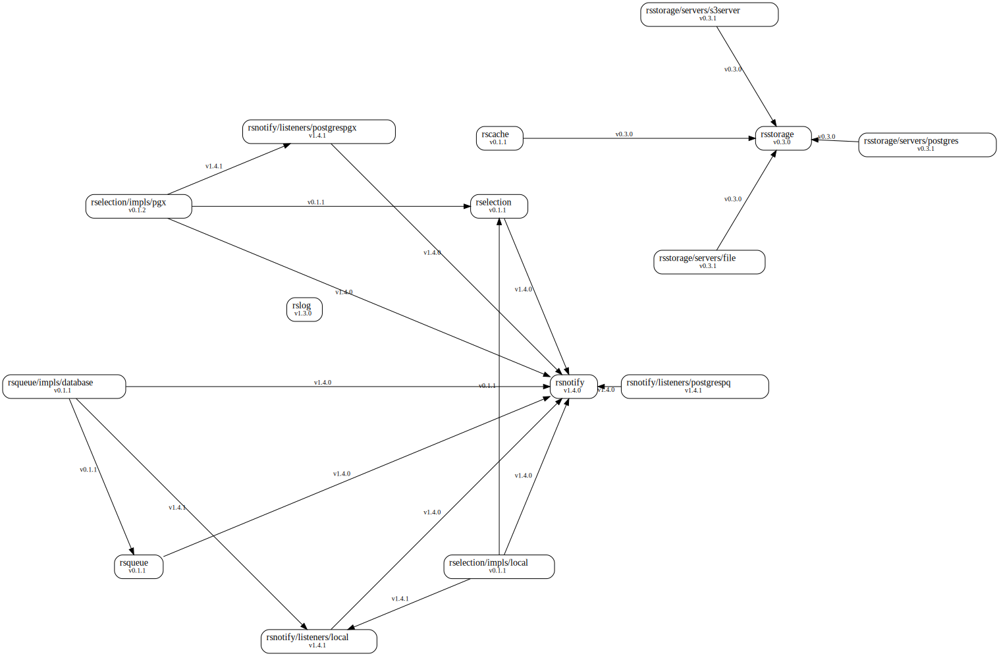

# RStudio Platform Go Libraries

## Overview

This repo includes useful Go code for building applications.

## Graph



## Go Directories

### `/internal`

Private application and library code. This is for code we don't want others
importing in their applications or libraries. Note that this layout pattern is
enforced by the Go compiler itself. See the Go 1.4
[`release notes`](https://golang.org/doc/go1.4#internalpackages) for more
details. Note that you are not limited to the top level `internal` directory.
You can have more than one `internal` directory at any level of your project
tree.

You can optionally add a bit of extra structure to your internal packages to
separate your shared and non-shared internal code. It's not required (especially
for smaller projects), but it's nice to have visual clues showing the intended
package use. Your actual application code can go in the `/internal/app`
directory (e.g., `/internal/app/myapp`) and the code shared by those apps in the
`/internal/pkg` directory (e.g., `/internal/pkg/myprivlib`).

### `/pkg`

Shared library code for use by external applications (e.g., `/pkg/rslog`).
Other projects can import these libraries expecting them to work.

### `/examples`

Example applications that demonstrate using the shared libraries.

## Common Application Directories

### `/scripts`

Scripts to perform various build, install, linting, and documentation tasks.

These scripts keep the root level `justfile` small and simple (e.g.,
[`https://github.com/hashicorp/terraform/blob/master/Makefile`](https://github.com/hashicorp/terraform/blob/master/Makefile)).

### `/test`

End-to-end tests. These tests are performed in CI by GitHub Actions.

## Other Directories

### `/docs`

Design and user documents (in addition to your godoc generated documentation).

## Tooling

We use `just` to run project specific commands. See the 
[GitHub repository](https://github.com/casey/just) for installation and 
examples.

You will also need [Docker](https://docs.docker.com/get-docker/) if you wish to 
run the integration and end-to-end tests.

## Testing

We test multiple modules by default. Therefore, if you wish to test a specific
package, you must specify the `MODULE` env variable. See the examples below. 

Examples:

```bash
# Run all Go tests
just test

# Run all Go tests twice
just test -count 2 ./...

# Run all tests once (no cached results)
just test -count 1 ./...

# Run with verbose output
just test -v ./...

# Run the "TestNewDebugLog" test twice with verbose output
MODULE=pkg/rslog just test -v -count 2 github.com/rstudio/platform-lib/pkg/rslog/debug -testify.m=TestNewDebugLog

# Run the LocalNotifySuite suite tests with verbose output
MODULE=pkg/rsnotify just test -v github.com/rstudio/platform-lib/pkg/rsnotify/locallistener -check.f=LocalNotifySuite

# Run the PgxNotifySuite suite tests with docker-compose
MODULE=pkg/rsnotify just test-integration -v github.com/rstudio/platform-lib/pkg/rsnotify/pgxlistener -check.f=PgxNotifySuite
```

### Testing with Docker

End-to-end and integration tests are run with Docker. 

By default, Docker will use your host machine to infer which [platform to use 
when building image](https://docs.docker.com/engine/reference/builder/#from). 
You can specify another architecture with the `--platform` flag. Supported 
options are `linux/amd64` and `linux/arm64`.

If your machine is running on the same platform as the image you plan to use for 
testing, you can simply build the code natively. If not you will need to build a 
separate Docker image to cross-compile your code.

>Note: On Apple silicon, Docker will build linux/arm64 images by default. 
> However, you will need to cross-compile your code for the end-to-end tests 
> because binaries built on Darwin are not compatible with the Linux environment 
> in the Docker images and vice-versa.

Examples:

```bash
# Build the docker image used for end-to-end testing
just build-e2e-env

# Build the end-to-end testing image for ARM
just build-e2e-env --platform=linux/arm64

# Build the build-env image to cross-compile for ARM
just build-build-env --platform=linux/arm64

# Build the code natively
just build

# Build the code in Docker
just build-docker

# Run the end-to-end tests
just test-e2e

# Open an interactive container for end-to-end testing
just start-e2e-env
just test
exit

# Run the integration tests (uses the build-env image)
just test-integration
```

When re-building images for a different platform, Docker may ignore the platform 
flag and use cached layers from the previous build. To resolve this issue, 
remove the images and clear the build cache. You can do this manually for 
a single image or use the `just` target to clean up both images at once:

```bash
just clean-docker
```

## Licenses

To update `NOTICE.md` with a list of licenses from third-party Go modules,
use the `just licenses` target. This requires Python 3.

## Versioning

Follow semantic versioning guidelines. To release a new version, we simply
create and push a tag.

```shell
git tag v0.1.2
git push origin v0.1.2
```

To enumerate the latest version tag for each module, run:

```shell
just versions
```

## Badges

* [Go Report Card](https://goreportcard.com/) - It will scan your code with
  `gofmt`, `go vet`, `gocyclo`, `golint`, `ineffassign`, `license` and
  `misspell`. Replace `github.com/golang-standards/project-layout` with your
  project reference.

    [](https://goreportcard.com/report/github.com/rstudio/platform-lib)

* [Pkg.go.dev](https://pkg.go.dev) - Pkg.go.dev is a new destination for Go
  discovery & docs. You can create a badge using the
  [badge generation tool](https://pkg.go.dev/badge).

    [](https://pkg.go.dev/github.com/rstudio/platform-lib)

* Release - It will show the latest release number for your project. Change the
  github link to point to your project.

    [](https://github.com/rstudio/platform-lib/releases/latest)
